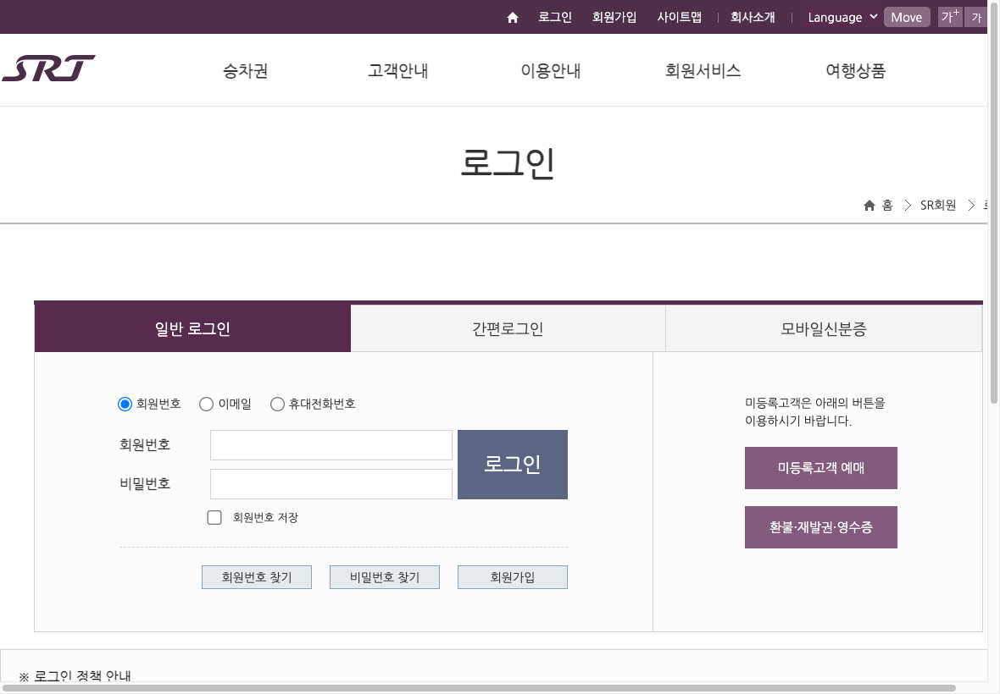
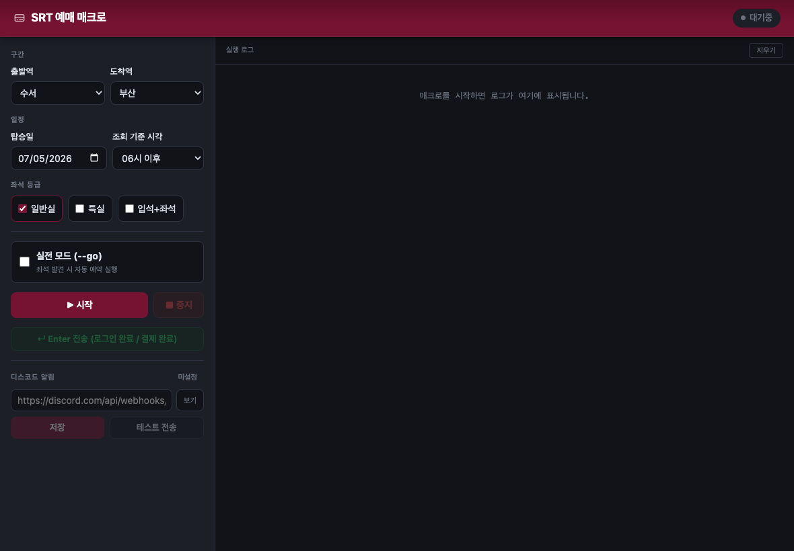
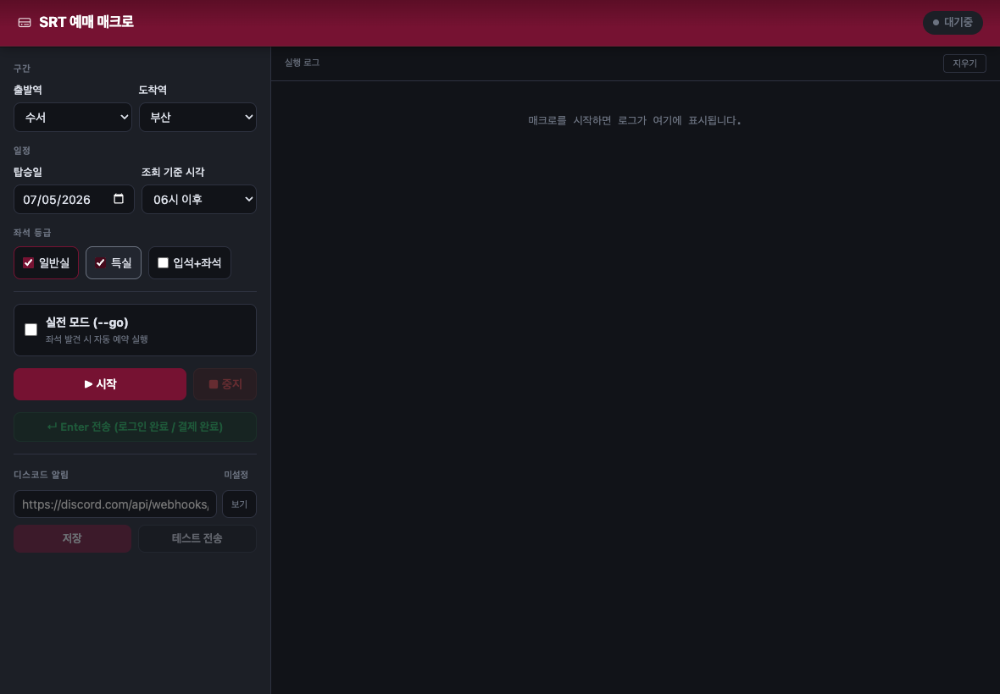

# SRT 승차권 예매 매크로

SRT(`etk.srail.kr`)에서 목표 열차를 지정해두면, 매진 여부를 자동으로 감시하다가 취소표가
나오는 즉시(또는 예약대기가 열리는 즉시) 예약까지 진행해주는 Playwright 기반 매크로입니다.
CLI, 웹 UI, 데스크탑 앱(macOS/Windows) 세 가지 방식으로 사용할 수 있습니다.

## 사전 준비

```bash
npm install
npx playwright install chromium
```

- Node.js 18+ 권장 (개발 환경은 v25 사용).
- 실행하면 브라우저 창이 뜨고, 최초 1회는 SRT 로그인을 직접 해야 합니다. 로그인 후
  `https://etk.srail.kr/main.do` 이동을 감지하면 세션이 `srt_session.json`에 자동 저장되어
  다음 실행부터 자동 로그인됩니다(만료되면 다시 수동 로그인 요청).

  

## 사용 방법 1 — CLI

```bash
npm run srt -- --dep 수서 --arr 부산 --date 20260710 --time 14 --target-time 15:00 --target-end-time 17:00 --seat 일반실 --go
```

`--go` 없이 실행하면 **dry-run**(좌석 발견 로그만 찍고 실제 예약 클릭은 하지 않음) 모드입니다.
동작을 먼저 확인하고 싶다면 `--go`를 빼고 실행해보세요.

### 옵션

| 옵션 | 설명 | 기본값 |
| :--- | :--- | :--- |
| `--dep` | 출발역 이름 | `수서` |
| `--arr` | 도착역 이름 | `부산` |
| `--date` | 탑승일 (YYYYMMDD) | 필수 |
| `--time` | SRT 조회 기준 시각 (00/02/04/…/22) | `06` |
| `--target-time` | 예매 탐색을 시작할 열차 출발시각(HH:mm, 경계 포함). 조회 기준 시각보다 빠르게 설정할 수 없음 | `--time`의 정각 |
| `--target-end-time` | 예매 탐색을 끝낼 열차 출발시각(HH:mm, 경계 포함). 탐색 시작 시각보다 빠르게 설정할 수 없음 | `23:59` |
| `--seat` | 좌석 등급. `일반실` \| `특실` \| `입석+좌석`. 콤마로 복수 지정 가능(`일반실,특실`) — 우선순위는 입력 순서 | `일반실` |
| `--interval` | 재조회 간격(ms). `0`이면 800~1500ms 랜덤 딜레이 사용(권장) | `0` |
| `--go` | 실전 실행 플래그. 없으면 dry-run | 없음 |
| `--no-sms` | 예약대기 신청 시 SMS 수신 동의 거부 | 동의(기본) |
| `--wait-special` | 일반실 예약대기 신청 시 특실 취소표도 배정 수락 | 거부(기본) |
| `--force-poll` | D-2 이상이어도 예약대기 모드 대신 취소표 폴링 모드 강제 | 없음 |

### 실행 모드 자동 판단

탑승일까지 남은 일수(`daysUntil(--date)`)로 모드가 자동 결정됩니다.

- **D-2 이상 → WAITLIST 모드**: 매진 열차의 "예약대기" 버튼을 찾아 자동 신청.
- **D-1 이하 → POLLING 모드**: 취소표가 뜨는지 실시간으로 재조회하다가 나오면 즉시 예약.

두 모드 모두 좌석을 확보하면 macOS 알림 + (설정 시) Discord 웹훅으로 알려줍니다.
**결제는 자동화하지 않습니다** — 알림을 받으면 직접 브라우저에서 결제를 완료하세요.

### 새 역 추가하기

`config.ts`의 `STATION_CODE` 맵에 없는 역은 etk.srail.kr 조회 폼에서 DevTools로
`dptRsStnCd` 값을 확인해 `역이름: "코드"` 형태로 추가하면 됩니다.

## 사용 방법 2 — 웹 UI

터미널 대신 브라우저 화면에서 값을 입력하고 로그를 실시간으로 보고 싶다면:

```bash
npm run ui
```

API 서버(기본 3001번, 사용 중이면 자동으로 빈 포트로 전환)와 Vite dev 서버(3002번)가
동시에 뜹니다. 안내된 주소로 접속해 구간·탑승일·조회 기준 시각·예매 탐색 시작·끝 시각·좌석 등급을 입력하고
"시작"을 누르면 됩니다. 로그인 완료는 자동 감지하며, 결제 완료 후 입력이 필요한 시점에는
화면의 "Enter 전송" 버튼으로 터미널 입력을 대신할 수 있습니다.

SRT 조회 시각은 2시간 단위지만 예매 탐색 시작·끝 시각은 분 단위로 지정할 수 있습니다.
예를 들어 조회 기준을 `14시 이후`, 예매 탐색 시작을 `15:00`, 끝을 `17:00`으로 설정하면
결과 목록에서 15:00부터 17:00까지 출발하는 열차만 좌석·예약대기 대상으로 확인합니다.
시작과 끝 시각에 정확히 일치하는 열차도 탐색 범위에 포함됩니다.



좌석 등급은 콤마 없이 체크박스로 복수 선택할 수 있습니다 — 체크한 순서가 그대로
우선순위(먼저 체크한 등급의 취소표/예약대기를 우선 사용)가 됩니다.



## 사용 방법 3 — 데스크탑 앱 (macOS / Windows)

터미널 사용 없이 더블클릭만으로 쓰고 싶다면 앱으로 패키징할 수 있습니다.

```bash
# macOS (.dmg, arm64)
npm run electron:build:mac

# Windows (.exe 설치본, NSIS)
npm run electron:build
```

빌드 결과물은 `release/` 폴더에 생성됩니다. 설치 후 실행하면 웹 UI와 동일한 화면이
독립된 앱 창으로 뜹니다. 이미 실행 중인 상태에서 앱을 다시 실행하면 새 창이 뜨는 대신
기존 창이 포커스됩니다(중복 실행 방지). 새 버전을 재설치할 때는 macOS는 Finder에서
"교체", Windows는 설치 마법사가 기존 버전을 자동으로 인식해 업그레이드합니다.

## Discord 알림 설정 (선택)

좌석 확보/예약대기 완료 시 Discord 채널로도 알림을 받고 싶다면 웹훅 URL을 설정하세요.
우선순위는 아래 순서대로 적용됩니다.

1. 환경변수 `DISCORD_WEBHOOK_URL`
2. 웹 UI의 "Discord 설정"에서 저장한 값 (`discord_webhook.txt`)
3. `.env` 파일의 `DISCORD_WEBHOOK_URL=...` (상위 폴더까지 탐색)

미설정 시 실행 배너에 "디스코드: 미설정 (알림 안 옴!)"으로 표시됩니다.

## 개발자용

```bash
npm test          # 단위 테스트 (config, seatSelection)
npm run test:browser  # trainSelect DOM 파싱 브라우저 테스트
npx tsc --noEmit  # 타입체크
```

파일 구조와 아키텍처 규칙은 `../CLAUDE.md`의 `srt/` 섹션을 참고하세요.
